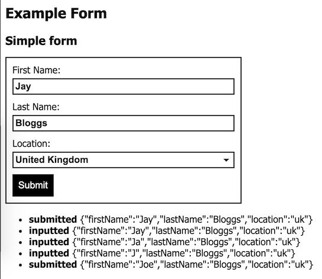

# minthril-form
A form ui library for minthril.

[Live demo](https://minthril-form.onrender.com/)

## Screenshot


## Example Usage
```javascript
const {createForm, createTextInput } = require('minthril-form');

h(
  'div',
  { class: 'someForm' },
  createForm(minthril, {
    fields: [{
      name: 'firstName',
      label: 'First Name',
      component: createTextInput,
      autoFocus: true,
      initialValue: 'Joe'
    }, {
      name: 'lastName',
      label: 'Last Name',
      component: createTextInput,
      initialValue: 'Bloggs'
    }
  )
)
```